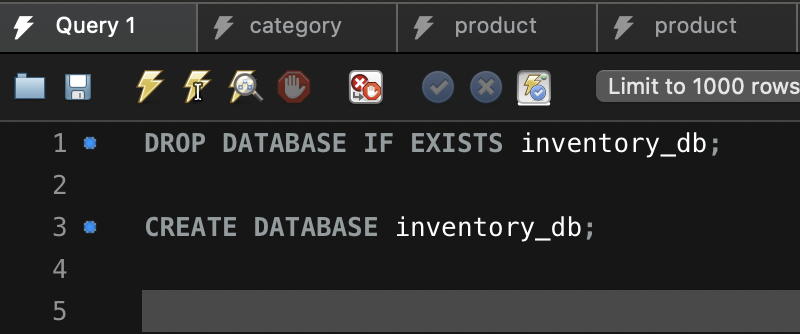
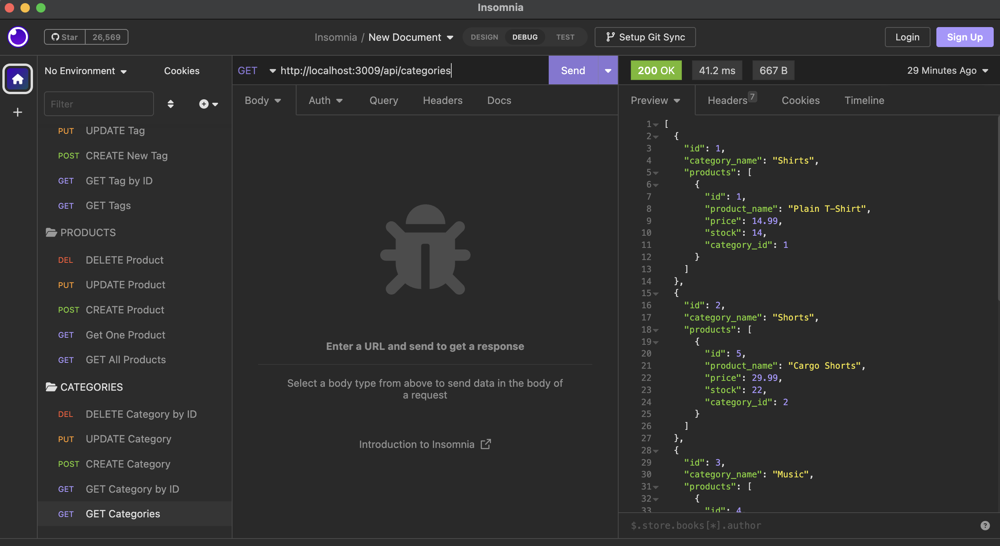

## E-commerceBackEnd

## Description

The purpose of this project was to create a route to back end data stored through sql all done from Javascript. This was done through using tool such as mysql2, sequelize, express, dotenv and node of course. Where one can create a database in sql from a schema, seed some data and then access that data through specific routes and the nbe able to manipulate the data such as not only getting it but allowing it to be modfiable as well. The context of this project was the inventory of a typical store. The different problems which it solves is so digitally register aan e commerce's inventory.

## Table of Contents (Optional)

- [Installation](#installation)
- [Usage](#usage)

## Installation

If wish to install this project just make sure to clone the repo and have all of the requirements installed:
Download SQL and Node from the internet, and I recommend MySQLWorkbench as well in order to create the database.

After that open the folder inside of your terminal and install all of the dependencies through these commands:
`npm install --save sequelize`
`npm install dotenv --save`
`npm install --save mysql2`
`npm install express`

After installing the dependencies make sure to go into the `db` folder and find the `schema.sql` file and run the query inside of the MySQL Workbench

After following these steps Use the command `node server.js` to activate the server and initialize the connection to the sql database that you should have activated.

After that, open another terminal and run the command `npm run seed` in order to seed the database with data. And you're good to go.

Now you can navigate to the different routes under api in order to see the data.

## Usage

Here's an example of what running your query should look like. Paste this command in your query and run it by clicking the lightning bolt, in this instance.

Here's what the correct response should look like after you have created your SQL database and run `node server.js` in order to create the server and connect the sql file to it.

Here's what your terminal should look like after you have run the command in order to seed your data

And here's what an example response from the different types of request can you can send to the route will give you back:

